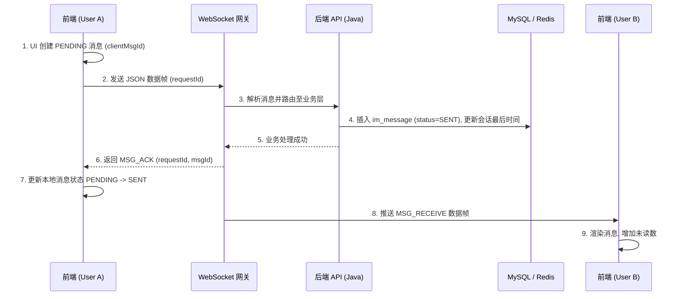
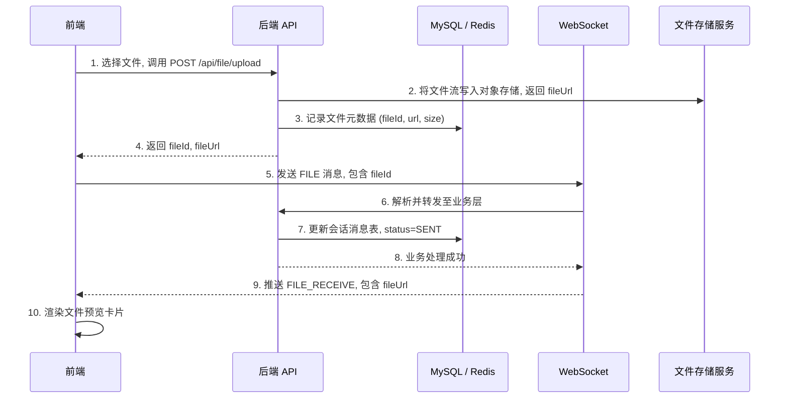
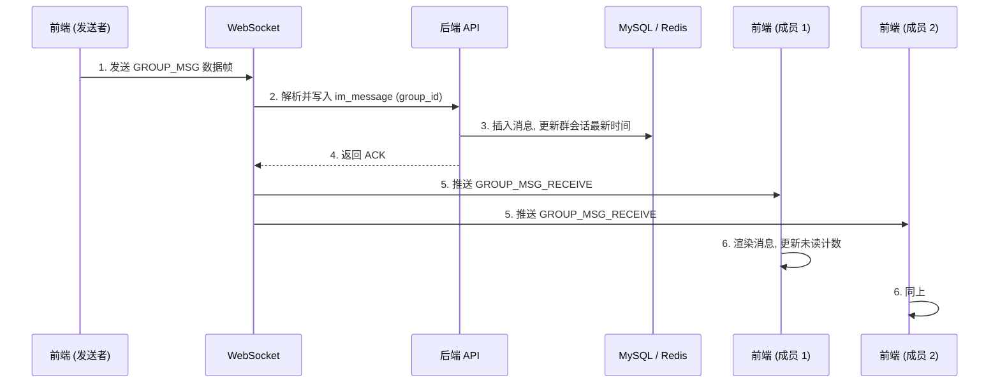
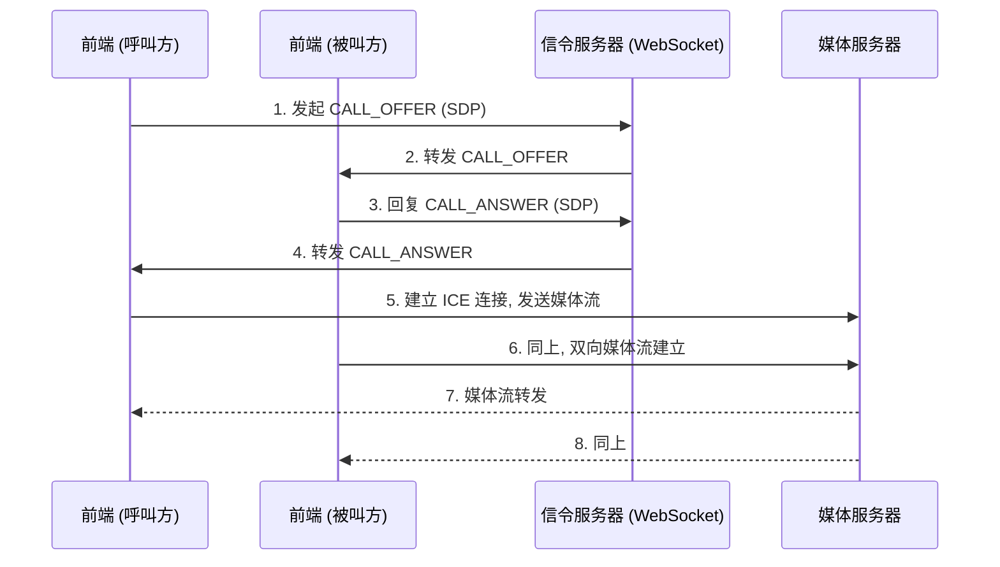
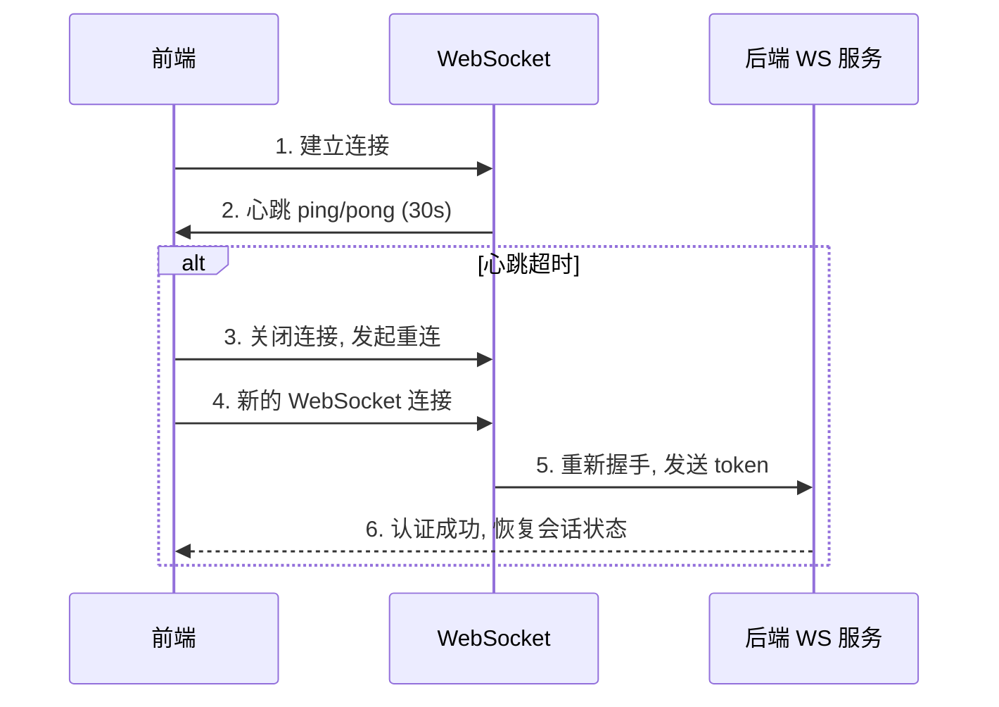

# 36 全链路数据流与时序图 (Full‑Stack Data Flow)

> **定位**：定义 IM 核心业务在全栈环境下的物理流向，锁定前后端、Redis 与 WS 的每一处交互。

---

## 1. 文本消息发送时序 (P0 – Message Flow)

---

## 2. 语音转文字业务流 (P1 – Audio AI Flow)

1. **录制**：前端使用本地 `MediaRecorder` 录制 OGG/MP3。\
2. **上传**：调用 `POST /api/file/upload` 存入本地文件系统。\
3. **发送**：WS 发送 `VOICE` 消息，附带 `fileUrl`。\
4. **异步触发**：后端收到语音消息后，触发 `SpeechToTextTask`。\
5. **通知**：转写完成后，通过 WS 推送 `MSG_UPDATE_EXT`（包含转写文字），前端气泡自动显示文字。

---

## 3. 文件上传与预览流 (P2 – File Upload Flow)

---

## 4. 群聊消息广播流 (P3 – Group Chat Flow)

---

## 5. 音视频通话建立流 (P4 – Call Setup Flow)

---

## 6. WebSocket 重连与心跳 (P5 – WS Reconnection)

---

## 7. 全局异常处理流

- **逻辑**：所有异常统一经过 `GlobalExceptionHandler`。\
- **契约**：必须返回 `docs/37` 定义的 5 位错误码。\
- **动作**：前端 Axios 拦截器捕获非 200 返回值，自动弹出 `ElMessage` 并停止 Loading。
