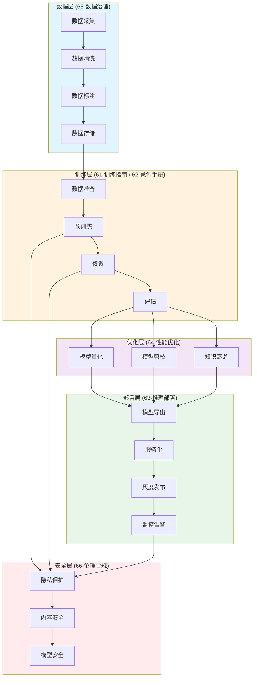

# 60 AI大模型开发总览

> **版本**: v1.0.0
> **更新日期**: 2026-04-14
> **兼容性**: Python 3.10+ | PyTorch 2.0+ | Transformers 4.36+ | CUDA 11.8+
> **状态**: 活跃开发中

---

## 文档定位

本章节为 **AI大模型开发专项文档体系** 的索引入口，涵盖从模型训练、微调到生产部署的全生命周期技术指引。

## 核心原则

1. **数据优先**：任何模型优化必须以数据质量为基础
2. **可复现性**：所有实验必须记录完整配置与参数
3. **安全合规**：严格遵守数据隐私与AI伦理规范
4. **性能导向**：在保证效果的前提下追求推理效率

---

## 文档体系结构

| 编号 | 文档 | 说明 |
|-----|------|------|
| 60 | [60-AI大模型开发总览.md](60-AI大模型开发总览.md) | **本文档**：文档体系索引 |
| 61 | [61-模型训练指南.md](61-模型训练指南.md) | 数据准备、训练配置、分布式训练 |
| 62 | [62-模型微调手册.md](62-模型微调手册.md) | LoRA/QLoRA/全量微调技术方案 |
| 63 | [63-推理部署与上线.md](63-推理部署与上线.md) | 模型导出、服务化部署、灰度策略 |
| 64 | [64-性能优化与压缩.md](64-性能优化与压缩.md) | 量化压缩、剪枝、推理加速 |
| 65 | [65-数据治理规范.md](65-数据治理规范.md) | 数据采集、清洗、标注、存储规范 |
| 66 | [66-伦理合规与安全.md](66-伦理合规与安全.md) | 隐私保护、内容安全、模型安全 |
| 67 | [67-AI-API参考手册.md](67-AI-API参考手册.md) | 中英文API参数对照、错误码表 |
| 68 | [68-端到端实战教程.md](68-端到端实战教程.md) | 全流程可执行教程 |
| 69 | [69-质量门禁与验收标准.md](69-质量门禁与验收标准.md) | 文档质量、代码质量、验收指标 |

---

## 快速导航

### 按角色导航

| 角色 | 推荐阅读路径 |
|-----|-------------|
| **AI研究员/算法工程师** | 61 → 62 → 64 → 68 |
| **后端开发/DevOps** | 63 → 64 → 68 → 69 |
| **数据工程师** | 65 → 61 → 68 |
| **安全合规专员** | 66 → 65 → 69 |
| **产品/项目经理** | 60 → 68 → 69 |

### 按场景导航

| 场景 | 推荐文档 |
|-----|---------|
| 首次接触项目 | 60 → 68（快速开始） |
| 数据准备 | 65 → 61（数据章节） |
| 模型训练 | 61 → 62 |
| 模型部署 | 63 → 64 |
| 性能调优 | 64 → 63（部署优化章节） |
| 合规审查 | 66 → 65 |

---

## 架构总览



---

## 版本兼容性矩阵

| 组件 | 最低版本 | 推荐版本 | 最高测试版本 |
|-----|---------|---------|------------|
| Python | 3.9 | 3.10 | 3.11 |
| PyTorch | 2.0 | 2.2 | 2.3 |
| Transformers | 4.36 | 4.38 | 4.40 |
| CUDA | 11.8 | 12.1 | 12.4 |
| NVIDIA Driver | 520 | 535 | 550 |
| cuDNN | 8.8 | 8.9 | 9.0 |

---

## 环境依赖

### 硬件要求

| 场景 | GPU显存 | CPU | 内存 | 存储 |
|-----|--------|-----|------|------|
| 预训练 | 80GB×8 | 64核 | 512GB | 2TB SSD |
| 全量微调 | 80GB | 32核 | 128GB | 500GB SSD |
| LoRA微调 | 24GB | 16核 | 64GB | 200GB SSD |
| 推理部署 | 16GB | 8核 | 32GB | 100GB SSD |

### Python依赖

```yaml
# 核心依赖（requirements-ai.txt）
torch>=2.0.0
transformers>=4.36.0
accelerate>=0.25.0
peft>=0.7.0
bitsandbytes>=0.41.0
vllm>=0.2.0
tensorrt>=8.6.0
deepspeed>=0.12.0
trl>=0.7.0
datasets>=2.16.0
```

---

## 变更记录

| 日期 | 版本 | 变更内容 |
|-----|------|---------|
| 2026-04-14 | v1.0.0 | 初始版本，建立完整AI大模型开发文档体系 |
| - | - | - |

---

## 相关文档

- [02-大模型研发规范.md](02-大模型研发规范.md) - 开发行为规范
- [01-AI全栈开发综合指南.md](01-AI全栈开发综合指南.md) - 项目快速入门
- [68-端到端实战教程.md](68-端到端实战教程.md) - 实战演练
