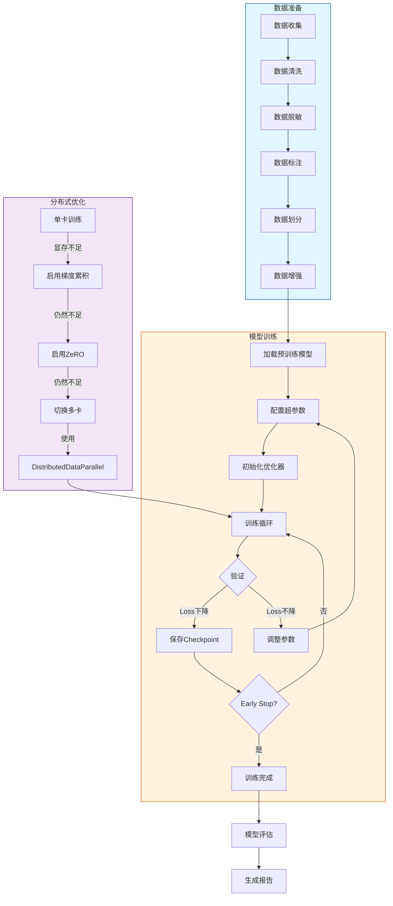

# 61 模型训练指南

> **版本**: v1.0.0
> **更新日期**: 2026-04-14
> **兼容性**: PyTorch 2.0+ | Transformers 4.36+ | DeepSpeed 0.12+
> **前置条件**: GPU服务器、Python 3.10+环境、CUDA 11.8+

---

## 概述 (Overview)

本文档详细描述模型训练的全流程，包括数据准备、训练配置、分布式训练、实验追踪等核心环节。

### 训练流程总览



## 一、环境准备 (Environment Setup)

### 1.1 硬件检查

```bash
# 检查GPU可用性
nvidia-smi

# 检查CUDA版本
nvcc --version

# 检查PyTorch与CUDA兼容性
python -c "import torch; print(f'PyTorch: {torch.__version__}'); print(f'CUDA: {torch.cuda.is_available()}')"
```

### 1.2 虚拟环境创建

```bash
# 使用conda创建环境
conda create -n llm-training python=3.10 -y
conda activate llm-training

# 安装PyTorch（根据CUDA版本选择）
# CUDA 11.8
pip install torch==2.2.0 torchvision torchaudio --index-url https://download.pytorch.org/whl/cu118

# CUDA 12.1
pip install torch==2.2.0 torchvision torchaudio --index-url https://download.pytorch.org/whl/cu121

# 安装核心依赖
pip install -r requirements-ai.txt
```

### 1.3 验证安装

```python
# 验证脚本：verify_environment.py
import torch
from transformers import AutoModel, AutoTokenizer

def verify_environment():
    print(f"PyTorch版本: {torch.__version__}")
    print(f"CUDA可用: {torch.cuda.is_available()}")

    if torch.cuda.is_available():
        print(f"GPU数量: {torch.cuda.device_count()}")
        print(f"GPU名称: {torch.cuda.get_device_name(0)}")
        print(f"GPU显存: {torch.cuda.get_device_properties(0).total_memory / 1024**3:.2f} GB")

    # 验证模型加载
    tokenizer = AutoTokenizer.from_pretrained("gpt2", trust_remote_code=True)
    model = AutoModel.from_pretrained("gpt2", trust_remote_code=True)
    print("模型加载成功!")

if __name__ == "__main__":
    verify_environment()
```

---

## 二、数据准备 (Data Preparation)

### 2.1 数据源分类

| 数据类型 | 来源 | 用途 | 注意事项 |
|---------|-----|------|---------|
| 预训练数据 | 公开语料/爬虫 | 语言理解能力 | 需版权审核 |
| 指令微调数据 | 人工标注/模板生成 | 任务适配能力 | 质量优先 |
| 对话数据 | 客服记录/社交 | 对话能力 | 需脱敏处理 |
| 领域数据 | 行业文档/内部知识库 | 领域专业能力 | 需保密协议 |

### 2.2 数据格式标准

```javascript
// 标准JSONL格式（每行一个JSON对象）
{"text": "用户问题：如何安装Python？\n回答：1. 下载Python安装包..."}
{"text": "系统提示：你是专业的技术助手..."}

// 对话格式
{
  "messages": [
    {"role": "system", "content": "你是一个有帮助的助手"},
    {"role": "user", "content": "什么是机器学习？"},
    {"role": "assistant", "content": "机器学习是人工智能的一个分支..."}
  ]
}

// 指令格式
{
  "instruction": "将以下英文翻译成中文",
  "input": "Hello, world!",
  "output": "你好，世界！"
}
```

### 2.3 数据清洗流程

```python
# 数据清洗脚本：data_cleaning.py
import re
from datasets import load_dataset

class DataCleaner:
    def __init__(self):
        self.min_length = 10
        self.max_length = 4096

    def remove_html_tags(self, text: str) -> str:
        """移除HTML标签"""
        return re.sub(r'<[^>]+>', '', text)

    def remove_urls(self, text: str) -> str:
        """移除URL链接"""
        return re.sub(r'http[s]?://\S+', '', text)

    def remove_emails(self, text: str) -> str:
        """移除邮箱地址"""
        return re.sub(r'\S+@\S+\.\S+', '', text)

    def remove_special_chars(self, text: str) -> str:
        """移除特殊字符（保留中文、英文、数字、常用标点）"""
        return re.sub(r'[^\u4e00-\u9fa5a-zA-Z0-9\s.,!?;:，。！？；：""''（）]', '', text)

    def normalize_whitespace(self, text: str) -> str:
        """规范化空白字符"""
        return re.sub(r'\s+', ' ', text).strip()

    def filter_by_length(self, text: str) -> bool:
        """按长度过滤"""
        length = len(text.strip())
        return self.min_length <= length <= self.max_length

    def clean(self, text: str) -> str | None:
        """完整清洗流程"""
        if not text or not text.strip():
            return None

        text = self.remove_html_tags(text)
        text = self.remove_urls(text)
        text = self.remove_emails(text)
        text = self.remove_special_chars(text)
        text = self.normalize_whitespace(text)

        if not self.filter_by_length(text):
            return None

        return text

def process_dataset(input_path: str, output_path: str):
    """处理数据集"""
    cleaner = DataCleaner()
    cleaned_data = []

    with open(input_path, 'r', encoding='utf-8') as f:
        for line in f:
            item = json.loads(line)
            cleaned_text = cleaner.clean(item.get('text', ''))
            if cleaned_text:
                cleaned_data.append({'text': cleaned_text})

    with open(output_path, 'w', encoding='utf-8') as f:
        for item in cleaned_data:
            f.write(json.dumps(item, ensure_ascii=False) + '\n')

    print(f"清洗完成：{len(cleaned_data)} 条数据保存至 {output_path}")
```

### 2.4 数据集划分

```python
# 数据划分脚本：split_dataset.py
from datasets import load_dataset
from sklearn.model_selection import train_test_split

def split_dataset(
    dataset_path: str,
    output_dir: str,
    train_ratio: float = 0.9,
    val_ratio: float = 0.05,
    test_ratio: float = 0.05,
    seed: int = 42
):
    """
    数据集划分

    参数说明 (Parameters):
        dataset_path: str - 输入数据集路径 (Input dataset file path)
        output_dir: str - 输出目录 (Output directory)
        train_ratio: float - 训练集比例 (Training set ratio) Default: 0.9
        val_ratio: float - 验证集比例 (Validation set ratio) Default: 0.05
        test_ratio: float - 测试集比例 (Test set ratio) Default: 0.05
        seed: int - 随机种子 (Random seed) Default: 42

    返回值 (Return Value):
        dict - 包含train/val/test数据集的字典
    """
    assert abs(train_ratio + val_ratio + test_ratio - 1.0) < 1e-6, "比例之和必须为1"

    dataset = load_dataset('json', data_files=dataset_path, split='train')
    train_val, test = train_test_split(
        dataset, test_size=test_ratio, random_state=seed
    )
    train_size = val_ratio / (train_ratio + val_ratio)
    train, val = train_test_split(
        train_val, test_size=train_size, random_state=seed
    )

    return {
        'train': train,
        'val': val,
        'test': test
    }
```

---

## 三、训练配置 (Training Configuration)

### 3.1 基础配置参数

| 参数 | 中文说明 | English Description | 默认值 | 推荐值 |
|-----|---------|---------------------|-------|--------|
| `model_name_or_path` | 模型名称或路径 | Base model identifier | 必填 | - |
| `tokenizer_name` | 分词器名称 | Tokenizer identifier | 与model相同 | - |
| `train_file` | 训练数据文件 | Training data file path | 必填 | - |
| `validation_file` | 验证数据文件 | Validation data file path | 可选 | - |
| `output_dir` | 输出目录 | Directory for checkpoints | 必填 | - |
| `max_seq_length` | 最大序列长度 | Maximum sequence length | 1024 | 2048/4096 |
| `per_device_train_batch_size` | 每设备训练批次大小 | Training batch size per GPU | 1 | 2-8 |
| `per_device_eval_batch_size` | 每设备评估批次大小 | Evaluation batch size per GPU | 1 | 2-8 |
| `learning_rate` | 学习率 | Initial learning rate | 1e-4 | 5e-5~3e-4 |
| `num_train_epochs` | 训练轮数 | Number of training epochs | 3 | 1-10 |
| `warmup_ratio` | 预热比例 | Warmup ratio | 0.1 | 0.05~0.2 |
| `gradient_accumulation_steps` | 梯度累积步数 | Gradient accumulation steps | 1 | 4-16 |
| `max_grad_norm` | 梯度裁剪范数 | Gradient clipping norm | 1.0 | 0.5~1.0 |

### 3.2 优化器配置

```yaml
# 优化器配置示例：optimizer_config.yaml
optimizer:
  type: "adamw_torch"
  args:
    lr: 5e-5
    weight_decay: 0.01
    betas: [0.9, 0.999]
    eps: 1e-8

scheduler:
  type: "cosine"
  args:
    num_warmup_steps: 100
    num_training_steps: 10000
    min_lr_ratio: 0.1
```

### 3.3 完整训练配置示例

```yaml
# training_config.yaml
model:
  model_name_or_path: "meta-llama/Llama-2-7b-hf"
  tokenizer_name: "meta-llama/Llama-2-7b-hf"
  trust_remote_code: true

data:
  train_file: "./data/train.jsonl"
  validation_file: "./data/val.jsonl"
  max_seq_length: 2048
  preprocessing_num_workers: 8

training:
  output_dir: "./output/llama2-7b-chat"
  per_device_train_batch_size: 2
  per_device_eval_batch_size: 2
  gradient_accumulation_steps: 8
  learning_rate: 5e-5
  num_train_epochs: 3
  warmup_ratio: 0.1
  lr_scheduler_type: "cosine"
  max_grad_norm: 1.0
  weight_decay: 0.01

  fp16: true
  bf16: false
  logging_steps: 10
  eval_steps: 500
  save_steps: 500
  save_total_limit: 3
  gradient_checkpointing: true

  report_to: "tensorboard"
  logging_dir: "./logs"
```

---

## 四、分布式训练 (Distributed Training)

### 4.1 单机多卡训练

```bash
# 使用torchrun进行单机多卡训练
torchrun --nproc_per_node=4 train.py \
    --config training_config.yaml \
    --deepspeed ds_config.json
```

### 4.2 DeepSpeed配置

```javascript
// ds_config.json - ZeRO Stage 2配置
{
  "train_batch_size": "auto",
  "train_micro_batch_size_per_gpu": "auto",
  "gradient_accumulation_steps": "auto",
  "fp16": {
    "enabled": "auto"
  },
  "zero_optimization": {
    "stage": 2,
    "offload_optimizer": {
      "device": "none"
    },
    "offload_param": {
      "device": "none"
    },
    "overlap_comm": true,
    "contiguous_gradients": true,
    "reduce_bucket_size": 5e7,
    "stage2_prefetch_bucket_size": 5e7,
    "stage2_param_persistence_threshold": 1e5,
    "stage2_max_live_parameters": 1e9,
    "stage2_max_reuse_distance": 1e9,
    "gather_16bit_weights_on_model_save": true
  },
  "gradient_clipping": 1.0,
  "steps_per_print": 10
}
```

### 4.3 多机多卡训练

```bash
# Node 0 (主节点)
torchrun \
    --nproc_per_node=8 \
    --nnodes=2 \
    --node_rank=0 \
    --master_addr=10.0.0.1 \
    --master_port=29500 \
    train.py --config training_config.yaml

# Node 1 (从节点)
torchrun \
    --nproc_per_node=8 \
    --nnodes=2 \
    --node_rank=1 \
    --master_addr=10.0.0.1 \
    --master_port=29500 \
    train.py --config training_config.yaml
```

### 4.4 FSDP配置

```javascript
// fsdp_config.json
{
  "fsdp_transformer_layer_cls_to_wrap": ["LlamaDecoderLayer"],
  "fsdp_sharding_strategy": "FULL_SHARD",
  "fsdp_state_dict_type": "FULL_STATE_DICT",
  "fsdp_backward_prefetch": "BACKWARD_PRE",
  "fsdp_forward_prefetch": false,
  "fsdp_limit_all_gathers": true,
  "fsdp_sync_module_states": true,
  "fsdp_use_orig_params": true
}
```

---

## 五、训练监控 (Training Monitoring)

### 5.1 TensorBoard集成

```bash
# 启动TensorBoard
tensorboard --logdir ./logs --port 6006

# 在训练配置中启用
training:
  report_to: "tensorboard"
  logging_dir: "./logs"
```

### 5.2 wandb集成

```bash
# 安装wandb
pip install wandb

# 登录
wandb login

# 训练配置
training:
  report_to: "wandb"
  wandb_project: "llm-training"
  wandb_run_name: "llama2-7b-exp001"
```

### 5.3 自定义监控指标

```python
# 自定义指标回调：custom_callbacks.py
from transformers import TrainerCallback
import wandb

class CustomMetricsCallback(TrainerCallback):
    def on_log(self, args, state, control, logs=None, **kwargs):
        if logs is not None:
            # 记录自定义指标
            if 'train_loss' in logs:
                wandb.log({"train_loss": logs['train_loss']})
            if 'eval_loss' in logs:
                wandb.log({"eval_loss": logs['eval_loss']})
            if 'learning_rate' in logs:
                wandb.log({"learning_rate": logs['learning_rate']})

    def on_step_end(self, args, state, control, **kwargs):
        # 每个step结束时的操作
        if state.global_step % 100 == 0:
            gpu_memory = torch.cuda.memory_allocated() / 1024**3
            print(f"Step {state.global_step}: GPU Memory = {gpu_memory:.2f} GB")
```

---

## 六、故障排查 (Troubleshooting)

### 6.1 常见问题

| 问题 | 可能原因 | 解决方案 |
|-----|---------|--------|
| CUDA Out of Memory | 批次太大 | 减小batch_size或启用梯度累积 |
| 梯度消失 | 学习率太低 | 提高学习率或使用warmup |
| loss不收敛 | 学习率不合适 | 调整学习率，检查数据质量 |
| 训练速度慢 | GPU利用率低 | 检查数据加载瓶颈，启用多worker |
| NaN loss | 数值不稳定 | 降低学习率，启用梯度裁剪 |

### 6.2 内存优化技巧

```python
# 梯度检查点（降低30%显存）
model.gradient_checkpointing_enable()

# 混合精度训练
from torch.cuda.amp import autocast, GradScaler
scaler = GradScaler()

# 启用TF32加速（Ampere架构GPU）
torch.backends.cuda.matmul.allow_tf32 = True
torch.backends.cudnn.allow_tf32 = True
```

---

## 变更记录

| 日期 | 版本 | 变更内容 |
|-----|------|---------|
| 2026-04-14 | v1.0.0 | 初始版本 |

---

## 相关文档

- [60-AI大模型开发总览.md](60-AI大模型开发总览.md) - 文档体系索引
- [62-模型微调手册.md](62-模型微调手册.md) - 微调技术方案
- [64-性能优化与压缩.md](64-性能优化与压缩.md) - 训练优化
