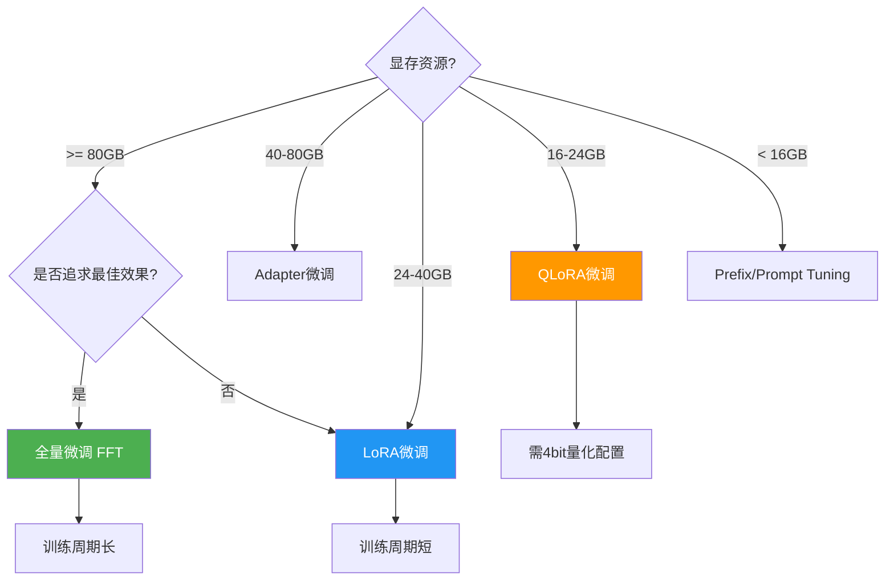
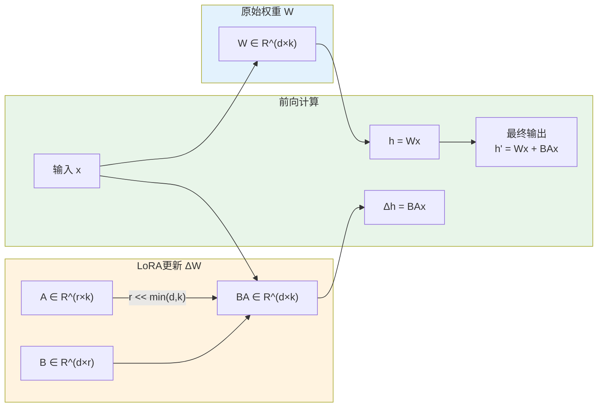

# 62 模型微调手册

> **版本**: v1.0.0
> **更新日期**: 2026-04-14
> **兼容性**: PEFT 0.7+ | Transformers 4.36+ | CUDA 11.8+
> **前置条件**: 预训练模型、标注数据集、GPU环境

---

## 概述 (Overview)

模型微调（Fine-tuning）是将预训练模型适配到特定任务的关键技术。本文档涵盖LoRA、QLoRA、全量微调等多种技术方案，提供完整配置模板与最佳实践。

### 微调技术选型决策树



### LoRA权重更新原理



## 一、微调技术对比 (Technique Comparison)

| 技术 | 参数量 | 显存需求 | 训练速度 | 效果 | 适用场景 |
|-----|--------|---------|---------|------|---------|
| 全量微调 (FFT) | 100% | 80GB+ | 慢 | 最优 | 充足算力、通用场景 |
| LoRA | 0.1%~1% | 24GB | 快 | 接近FFT | 资源受限、快速迭代 |
| QLoRA | 0.1%~1% | 16GB | 中等 | 良好 | 极致资源受限 |
| Adapter | 1%~5% | 40GB | 中等 | 良好 | 多任务切换 |
| Prefix Tuning | 0.1%~1% | 24GB | 快 | 良好 | 文本生成任务 |
| Prompt Tuning | <0.1% | 16GB | 最快 | 一般 | 极低成本场景 |

## 二、LoRA微调 (LoRA Fine-tuning)

### 2.1 原理说明

LoRA（Low-Rank Adaptation）通过在原模型权重旁添加低秩分解矩阵来实现参数高效微调：

```python
# LoRA核心思想
# 原始前向: h = Wx
# LoRA后: h = Wx + BAx, 其中 A ∈ R^(r×d), B ∈ R^(d×r), r << min(d, k)
```

### 2.2 依赖安装

```bash
pip install peft transformers accelerate bitsandbytes
```

### 2.3 基础配置

```python
# lora_config.py
from peft import LoraConfig, get_peft_model, TaskType

def create_lora_config(
    r: int = 8,
    lora_alpha: int = 16,
    lora_dropout: float = 0.05,
    target_modules: list = None
) -> LoraConfig:
    """
    创建LoRA配置

    参数说明 (Parameters):
        r: int - LoRA秩维度 (Rank dimension for low-rank matrices) Default: 8
        lora_alpha: int - LoRA alpha参数 (Scaling factor) Default: 16
        lora_dropout: float - Dropout概率 (Dropout probability) Default: 0.05
        target_modules: list - 目标模块列表 (Modules to apply LoRA) Default: None (自动检测)

    返回值 (Return Value):
        LoraConfig - LoRA配置对象
    """
    config = LoraConfig(
        r=r,
        lora_alpha=lora_alpha,
        lora_dropout=lora_dropout,
        target_modules=target_modules,
        bias="none",
        task_type=TaskType.CAUSAL_LM,
    )
    return config

# 默认目标模块（根据模型架构自动适配）
DEFAULT_TARGET_MODULES = {
    "llama": ["q_proj", "v_proj", "k_proj", "o_proj"],
    "chatglm": ["query_key_value", "dense"],
    "baichuan": ["W_pack"],
    "qwen": ["q_proj", "k_proj", "v_proj", "o_proj"]
}
```

### 2.4 完整训练脚本

```python
# train_lora.py
import torch
from transformers import (
    AutoModelForCausalLM,
    AutoTokenizer,
    TrainingArguments,
    Trainer,
    DataCollatorForLanguageModeling
)
from peft import LoraConfig, get_peft_model, prepare_model_for_kbit_training
from datasets import load_dataset

def train_lora(
    model_name: str,
    train_file: str,
    output_dir: str,
    r: int = 8,
    lora_alpha: int = 16,
    batch_size: int = 4,
    learning_rate: float = 3e-4,
    num_epochs: int = 3,
    **kwargs
):
    """
    LoRA微调训练

    参数说明 (Parameters):
        model_name: str - 预训练模型名称或路径 (Pretrained model name or path)
        train_file: str - 训练数据文件路径 (Training data file path)
        output_dir: str - 输出目录 (Output directory)
        r: int - LoRA秩维度 (LoRA rank dimension) Default: 8
        lora_alpha: int - LoRA alpha缩放因子 (LoRA alpha scaling factor) Default: 16
        batch_size: int - 批次大小 (Batch size) Default: 4
        learning_rate: float - 学习率 (Learning rate) Default: 3e-4
        num_epochs: int - 训练轮数 (Number of epochs) Default: 3

    返回值 (Return Value):
        None - 训练完成，模型保存至output_dir
    """
    # 加载分词器
    tokenizer = AutoTokenizer.from_pretrained(
        model_name,
        trust_remote_code=True,
        padding_side="right"
    )
    if tokenizer.pad_token is None:
        tokenizer.pad_token = tokenizer.eos_token

    # 加载模型
    model = AutoModelForCausalLM.from_pretrained(
        model_name,
        trust_remote_code=True,
        torch_dtype=torch.bfloat16,
        device_map="auto"
    )

    # 准备kbit训练（可选，用于QLoRA）
    model = prepare_model_for_kbit_training(model)

    # 配置LoRA
    lora_config = LoraConfig(
        r=r,
        lora_alpha=lora_alpha,
        lora_dropout=0.1,
        bias="none",
        task_type="CAUSAL_LM",
        target_modules=["q_proj", "v_proj", "k_proj", "o_proj"]
    )

    # 应用LoRA
    model = get_peft_model(model, lora_config)
    model.print_trainable_parameters()

    # 加载数据集
    def tokenize_function(examples):
        result = tokenizer(
            examples["text"],
            truncation=True,
            max_length=2048,
            padding="max_length"
        )
        result["labels"] = result["input_ids"].copy()
        return result

    dataset = load_dataset("json", data_files=train_file, split="train")
    tokenized_dataset = dataset.map(
        tokenize_function,
        batched=True,
        remove_columns=dataset.column_names
    )

    # 训练参数
    training_args = TrainingArguments(
        output_dir=output_dir,
        per_device_train_batch_size=batch_size,
        gradient_accumulation_steps=4,
        learning_rate=learning_rate,
        num_train_epochs=num_epochs,
        logging_dir=f"{output_dir}/logs",
        logging_steps=10,
        save_steps=500,
        save_total_limit=3,
        fp16=True,
        warmup_ratio=0.1,
        lr_scheduler_type="cosine",
        report_to="tensorboard"
    )

    # 数据整理器
    data_collator = DataCollatorForLanguageModeling(
        tokenizer=tokenizer,
        mlm=False
    )

    # 创建Trainer
    trainer = Trainer(
        model=model,
        args=training_args,
        train_dataset=tokenized_dataset,
        data_collator=data_collator
    )

    # 开始训练
    trainer.train()

    # 保存模型
    model.save_pretrained(output_dir)
    tokenizer.save_pretrained(output_dir)
    print(f"模型已保存至: {output_dir}")

if __name__ == "__main__":
    import fire
    fire.Fire(train_lora)
```

---

## 三、QLoRA微调 (QLoRA Fine-tuning)

### 3.1 量化配置

QLoRA结合4-bit量化和LoRA，大幅降低显存需求：

```python
# qloRA使用4-bit NF4量化
from transformers import BitsAndBytesConfig

bnb_config = BitsAndBytesConfig(
    load_in_4bit=True,                    # 4-bit量化加载
    bnb_4bit_quant_type="nf4",             # NF4量化类型
    bnb_4bit_compute_dtype=torch.bfloat16,
    bnb_4bit_use_double_quant=True         # 双重量化
)
```

### 3.2 QLoRA训练脚本

```python
# train_qloRA.py
import torch
from transformers import (
    AutoModelForCausalLM,
    AutoTokenizer,
    TrainingArguments,
    Trainer
)
from peft import LoraConfig, get_peft_model, prepare_model_for_kbit_training
from bitsandbytes.optim import AdamW8bit

def train_qloRA(
    model_name: str,
    train_file: str,
    output_dir: str,
    **training_config
):
    """
    QLoRA微调训练（极致显存优化）

    参数说明 (Parameters):
        model_name: str - 预训练模型名称 (Pretrained model name)
        train_file: str - 训练数据文件 (Training data file)
        output_dir: str - 输出目录 (Output directory)
        **training_config: dict - 其他训练参数 (Additional training args)

    显存需求 (Memory Requirements):
        7B模型: ~16GB GPU显存
        13B模型: ~24GB GPU显存
        70B模型: ~48GB GPU显存
    """
    # 4-bit量化配置
    bnb_config = BitsAndBytesConfig(
        load_in_4bit=True,
        bnb_4bit_quant_type="nf4",
        bnb_4bit_compute_dtype=torch.bfloat16,
        bnb_4bit_use_double_quant=True
    )

    # 加载模型（4-bit量化）
    model = AutoModelForCausalLM.from_pretrained(
        model_name,
        quantization_config=bnb_config,
        device_map="auto",
        trust_remote_code=True
    )
    model = prepare_model_for_kbit_training(model)

    # 加载分词器
    tokenizer = AutoTokenizer.from_pretrained(model_name, trust_remote_code=True)

    # LoRA配置
    lora_config = LoraConfig(
        r=64,
        lora_alpha=16,
        lora_dropout=0.05,
        task_type="CAUSAL_LM",
        target_modules=["q_proj", "v_proj"]
    )

    model = get_peft_model(model, lora_config)
    model.print_trainable_parameters()

    # 训练参数（使用8-bit优化器）
    training_args = TrainingArguments(
        output_dir=output_dir,
        per_device_train_batch_size=8,
        gradient_accumulation_steps=4,
        learning_rate=2e-4,
        num_train_epochs=3,
        optim="paged_adamw_8bit",  # 分页8-bit AdamW
        fp16=True,
        **training_config
    )

    trainer = Trainer(
        model=model,
        args=training_args,
        train_dataset=load_dataset(train_file),
        data_collator=lambda x: x
    )

    trainer.train()
    model.save_pretrained(output_dir)
```

---

## 四、全量微调 (Full Fine-tuning)

### 4.1 适用场景

- 预训练模型与目标任务差异较大
- 有充足算力资源（80GB+ GPU）
- 追求最佳模型效果

### 4.2 全量微调配置

```python
# train_fft.py
from transformers import (
    AutoModelForCausalLM,
    AutoTokenizer,
    TrainingArguments,
    Trainer
)

def train_full_ft(model_name: str, train_file: str, output_dir: str):
    """
    全量微调训练

    注意事项 (Notes):
        - 需要至少80GB显存（7B模型）
        - 推荐使用DeepSpeed ZeRO-2或ZeRO-3
        - 训练时间约为LoRA的10倍
    """
    # 加载模型
    model = AutoModelForCausalLM.from_pretrained(
        model_name,
        trust_remote_code=True,
        torch_dtype=torch.bfloat16,
        device_map="auto"
    )

    tokenizer = AutoTokenizer.from_pretrained(model_name, trust_remote_code=True)

    # 训练参数
    training_args = TrainingArguments(
        output_dir=output_dir,
        per_device_train_batch_size=1,
        gradient_accumulation_steps=16,
        learning_rate=1e-5,
        num_train_epochs=3,
        bf16=True,                    # 使用BF16
        deepspeed="./ds_config.json", # DeepSpeed配置
        save_steps=1000,
        save_total_limit=2
    )

    trainer = Trainer(
        model=model,
        args=training_args,
        train_dataset=load_dataset(train_file)
    )

    trainer.train()
    model.save_pretrained(output_dir)
```

---

## 五、模型合并与导出 (Model Merge & Export)

### 5.1 LoRA权重合并

```python
# merge_lora.py
from peft import PeftModel
from transformers import AutoModelForCausalLM, AutoTokenizer
import torch

def merge_lora_weights(
    base_model_path: str,
    lora_path: str,
    output_path: str
):
    """
    合并LoRA权重到基座模型

    参数说明 (Parameters):
        base_model_path: str - 基座模型路径 (Base model path)
        lora_path: str - LoRA权重路径 (LoRA weights path)
        output_path: str - 合并后模型输出路径 (Merged model output path)

    返回值 (Return Value):
        None - 模型保存至output_path
    """
    # 加载基座模型
    base_model = AutoModelForCausalLM.from_pretrained(
        base_model_path,
        torch_dtype=torch.bfloat16,
        device_map="cpu",  # CPU上合并避免显存溢出
        trust_remote_code=True
    )

    # 加载LoRA权重
    model = PeftModel.from_pretrained(base_model, lora_path)

    # 合并权重
    merged_model = model.merge_and_unload()

    # 保存合并后的模型
    merged_model.save_pretrained(output_path)

    # 保存分词器
    tokenizer = AutoTokenizer.from_pretrained(base_model_path, trust_remote_code=True)
    tokenizer.save_pretrained(output_path)

    print(f"模型已合并并保存至: {output_path}")

    # 计算参数量
    total_params = sum(p.numel() for p in merged_model.parameters())
    print(f"总参数量: {total_params / 1e9:.2f}B")
```

### 5.2 导出HuggingFace格式

```python
# export_hf.py
from transformers import AutoModelForCausalLM, AutoTokenizer

def export_to_huggingface(model_path: str, repo_id: str):
    """
    导出模型到HuggingFace Hub

    参数说明 (Parameters):
        model_path: str - 本地模型路径 (Local model path)
        repo_id: str - HuggingFace仓库ID (HF repo ID, e.g., "user/model-name")

    返回值 (Return Value):
        None - 模型上传至HF Hub
    """
    model = AutoModelForCausalLM.from_pretrained(
        model_path,
        trust_remote_code=True
    )
    tokenizer = AutoTokenizer.from_pretrained(
        model_path,
        trust_remote_code=True
    )

    # 推送到Hub
    model.push_to_hub(repo_id)
    tokenizer.push_to_hub(repo_id)

    print(f"模型已推送至: https://huggingface.co/{repo_id}")
```

---

## 六、最佳实践 (Best Practices)

### 6.1 数据准备

| 场景 | 数据量建议 | 数据质量要求 |
|-----|-----------|-------------|
| 领域适配 | 10K~100K条 | 高质量，领域相关 |
| 任务微调 | 1K~10K条 | 高质量，多样性 |
| 对话优化 | 5K~50K轮 | 自然流畅，符合格式 |
| 风格迁移 | 100~1K条 | 风格一致性 |

### 6.2 超参数推荐

| 模型规模 | LoRA r | LoRA alpha | 学习率 | Batch Size |
|---------|--------|-----------|--------|-----------|
| 7B | 8~16 | 16~32 | 3e-4 | 4~8 |
| 13B | 16~32 | 32~64 | 2e-4 | 2~4 |
| 70B | 32~64 | 64~128 | 1e-4 | 1~2 |

### 6.3 训练技巧

```python
# 训练技巧配置
TRAINING_TIPS = {
    "gradient_checkpointing": True,      # 降低30%显存
    "optim": "paged_adamw_8bit",        # 节省40%显存
    "warmup_ratio": 0.1,                 # 预热比例
    "lr_scheduler": "cosine",            # 余弦学习率
    "weight_decay": 0.01,                # 权重衰减
    "max_grad_norm": 0.5,                # 梯度裁剪
    "use_flash_attention": True          # Flash Attention加速
}
```

---

## 变更记录

| 日期 | 版本 | 变更内容 |
|-----|------|---------|
| 2026-04-14 | v1.0.0 | 初始版本 |

---

## 相关文档

- [60-AI大模型开发总览.md](60-AI大模型开发总览.md) - 文档体系索引
- [61-模型训练指南.md](61-模型训练指南.md) - 训练基础
- [64-性能优化与压缩.md](64-性能优化与压缩.md) - 性能优化
