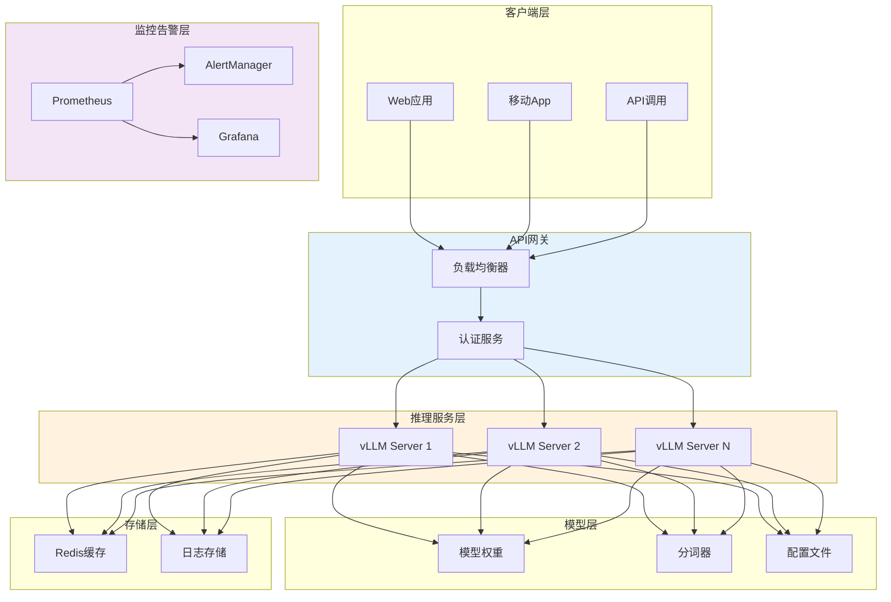
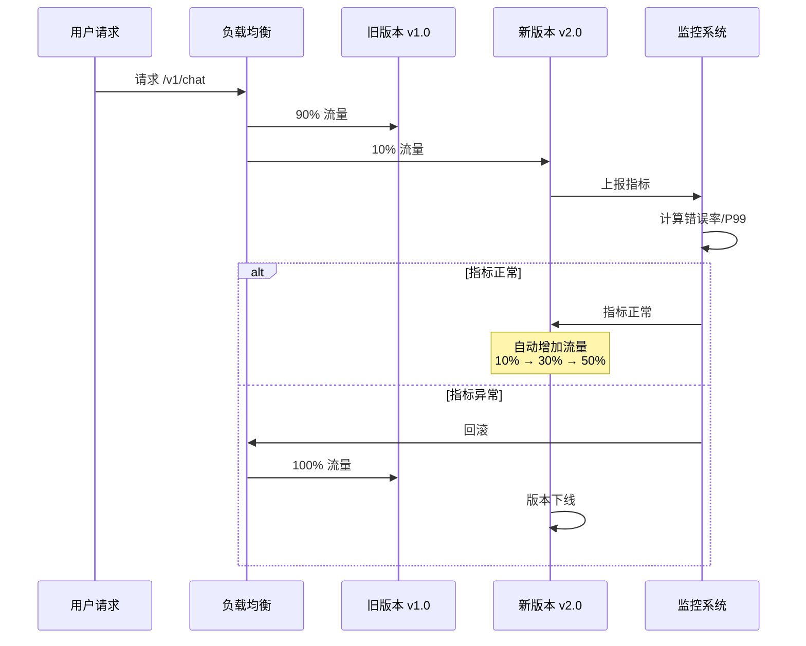

# 63 推理部署与上线

> **版本**: v1.0.0
> **更新日期**: 2026-04-14
> **兼容性**: vLLM 0.2+ | TensorRT-LLM | FastAPI | Docker 24+
> **前置条件**: 微调/量化模型、服务器环境、API需求

---

## 概述 (Overview)

本文档涵盖模型推理优化的全流程，包括模型导出、服务化部署、灰度策略、监控告警等关键环节，确保模型安全、稳定、高效地对外提供服务。

### 部署架构总览



### 灰度发布流程



## 一、模型导出 (Model Export)

### 1.1 HuggingFace格式导出

```python
# export_hf.py
from transformers import AutoModelForCausalLM, AutoTokenizer

def export_hf_model(
    model_path: str,
    output_path: str,
    safe_serialization: bool = True
):
    """
    导出为HuggingFace格式

    参数说明 (Parameters):
        model_path: str - 输入模型路径 (Input model path)
        output_path: str - 输出目录 (Output directory)
        safe_serialization: bool - 使用安全序列化 (Safe serialization) Default: True

    返回值 (Return Value):
        dict - 导出元信息，包含参数量、格式等
    """
    model = AutoModelForCausalLM.from_pretrained(
        model_path,
        trust_remote_code=True
    )
    tokenizer = AutoTokenizer.from_pretrained(
        model_path,
        trust_remote_code=True
    )

    # 保存模型
    model.save_pretrained(
        output_path,
        safe_serialization=safe_serialization
    )
    tokenizer.save_pretrained(output_path)

    # 计算参数量
    param_count = sum(p.numel() for p in model.parameters())
    trainable_params = sum(p.numel() for p in model.parameters() if p.requires_grad)

    return {
        "total_params": param_count,
        "trainable_params": trainable_params,
        "model_size_gb": param_count * 2 / 1e9,
        "format": "huggingface"
    }
```

### 1.2 ONNX格式导出

```python
# export_onnx.py
import torch
from transformers import AutoModelForCausalLM, AutoTokenizer
from optimum.onnxruntime import ORTModelForCausalLM

def export_to_onnx(
    model_path: str,
    output_path: str,
    precision: str = "fp16"
):
    """
    导出为ONNX格式

    参数说明 (Parameters):
        model_path: str - 输入模型路径 (Input model path)
        output_path: str - 输出目录 (Output directory)
        precision: str - 精度类型(fp16/fp32/int8) (Precision type) Default: fp16

    适用场景 (Use Cases):
        - 需要跨平台部署
        - 需要ONNX Runtime加速
        - 需要硬件特定优化
    """
    # 使用Optimum导出
    model = ORTModelForCausalLM.from_pretrained(
        model_path,
        export=True,
        opset=14
    )

    model.save_pretrained(output_path)
    print(f"ONNX模型已保存至: {output_path}")
```

---

## 二、服务化部署 (Serving Deployment)

### 2.1 vLLM部署

vLLM是高吞吐量的推理引擎，支持PagedAttention和Continuous Batching：

```bash
# 安装vLLM
pip install vllm>=0.2.0

# 启动vLLM服务
python -m vllm.entrypoints.openai.api_server \
    --model /path/to/model \
    --dtype half \
    --port 8000 \
    --tensor-parallel-size 2 \
    --gpu-memory-utilization 0.9 \
    --max-model-len 4096
```

### 2.2 FastAPI服务封装

```python
# api_server.py
from fastapi import FastAPI, HTTPException
from fastapi.responses import StreamingResponse
from pydantic import BaseModel, Field
from typing import Optional, List, Dict
import uvicorn
from vllm import LLM, SamplingParams

app = FastAPI(title="LLM Inference API")

# 全局模型实例
llm: Optional[LLM] = None

class ChatRequest(BaseModel):
    """聊天请求模型 / Chat Request Model"""
    messages: List[Dict[str, str]] = Field(
        ...,
        description="消息列表 / Message list"
    )
    temperature: float = Field(
        default=0.7,
        ge=0.0,
        le=2.0,
        description="温度参数，控制随机性 / Temperature for sampling"
    )
    max_tokens: int = Field(
        default=2048,
        ge=1,
        le=8192,
        description="最大生成长度 / Maximum tokens to generate"
    )
    top_p: float = Field(
        default=0.9,
        ge=0.0,
        le=1.0,
        description="核采样概率 / Nucleus sampling probability"
    )
    stream: bool = Field(
        default=False,
        description="是否流式输出 / Enable streaming output"
    )

class ChatResponse(BaseModel):
    """聊天响应模型 / Chat Response Model"""
    id: str
    object: str = "chat.completion"
    created: int
    model: str
    choices: List[Dict]
    usage: Dict[str, int]

def init_model(model_path: str, tensor_parallel_size: int = 1):
    """
    初始化模型

    参数说明 (Parameters):
        model_path: str - 模型路径 (Model path)
        tensor_parallel_size: int - 张量并行数 (Tensor parallel size) Default: 1
    """
    global llm
    llm = LLM(
        model=model_path,
        trust_remote_code=True,
        tensor_parallel_size=tensor_parallel_size,
        dtype="half"
    )
    print(f"模型已加载: {model_path}")

@app.post("/v1/chat/completions", response_model=ChatResponse)
async def chat_completions(request: ChatRequest):
    """
    聊天补全接口

    接口说明 (API Description):
        接收对话历史，返回模型生成的回答

    请求示例 (Request Example):
        // json
        {
            "messages": [
                {"role": "system", "content": "你是一个有帮助的助手"},
                {"role": "user", "content": "什么是机器学习？"}
            ],
            "temperature": 0.7,
            "max_tokens": 2048
        }

    响应示例 (Response Example):
        // json
        {
            "id": "chatcmpl-123",
            "object": "chat.completion",
            "created": 1677652288,
            "model": "llama2-7b",
            "choices": [{
                "index": 0,
                "message": {"role": "assistant", "content": "机器学习是..."},
                "finish_reason": "stop"
            }],
            "usage": {"prompt_tokens": 20, "completion_tokens": 100, "total_tokens": 120}
        }
    """
    if llm is None:
        raise HTTPException(status_code=500, detail="模型未初始化")

    # 构造提示词
    prompt = construct_prompt(request.messages)

    # 采样参数
    sampling_params = SamplingParams(
        temperature=request.temperature,
        top_p=request.top_p,
        max_tokens=request.max_tokens,
        stop=["</s>", "USER:"]
    )

    # 推理
    outputs = llm.generate([prompt], sampling_params)
    generated_text = outputs[0].outputs[0].text

    # 构建响应
    import time
    response = {
        "id": f"chatcmpl-{int(time.time())}",
        "object": "chat.completion",
        "created": int(time.time()),
        "model": "llm-inference",
        "choices": [{
            "index": 0,
            "message": {"role": "assistant", "content": generated_text},
            "finish_reason": "stop"
        }],
        "usage": {
            "prompt_tokens": len(prompt) // 4,
            "completion_tokens": len(generated_text) // 4,
            "total_tokens": (len(prompt) + len(generated_text)) // 4
        }
    }

    return response

def construct_prompt(messages: List[Dict[str, str]]) -> str:
    """构造模型输入提示词"""
    prompt = ""
    for msg in messages:
        role = msg.get("role", "user")
        content = msg.get("content", "")
        if role == "system":
            prompt += f"System: {content}\n"
        elif role == "user":
            prompt += f"User: {content}\n"
        elif role == "assistant":
            prompt += f"Assistant: {content}\n"
    prompt += "Assistant: "
    return prompt

@app.get("/health")
async def health_check():
    """健康检查接口 / Health Check Endpoint"""
    return {"status": "healthy", "model_loaded": llm is not None}

@app.get("/metrics")
async def metrics():
    """获取推理指标 / Get Inference Metrics"""
    return {
        "gpu_memory_allocated": llm.llm_engine.model_runner.model_input_gpu_allocator if llm else 0,
        "gpu_memory_reserved": llm.llm_engine.driver_worker.model_executor.driver_worker.cache_config.gpu_memory_utilization if llm else 0
    }

if __name__ == "__main__":
    import argparse
    parser = argparse.ArgumentParser()
    parser.add_argument("--model-path", type=str, required=True)
    parser.add_argument("--tp-size", type=int, default=1)
    args = parser.parse_args()

    init_model(args.model_path, args.tp_size)
    uvicorn.run(app, host="0.0.0.0", port=8000)
```

### 2.3 TensorRT-LLM部署

```bash
# 构建TensorRT-LLM模型
trtllm-build \
    --model_dir /path/to/model \
    --output_dir /path/to/engine \
    --dtype float16 \
    --tp_size 2 \
    --num_layers 32 \
    --hidden_size 4096 \
    --num_heads 32 \
    --vocab_size 32000 \
    --max_batch_size 64 \
    --max_input_len 4096 \
    --max_output_len 2048

# 启动TensorRT-LLM服务
trtllm-serve \
    --engine_dir /path/to/engine \
    --port 8000
```

---

## 三、灰度发布 (Canary Deployment)

### 3.1 灰度策略配置

```yaml
# canary_config.yaml
canary:
  # 流量分配策略
  traffic_split:
    - weight: 10    # 10%流量到新版本
      version: "v2.0"
    - weight: 90    # 90%流量保持旧版本
      version: "v1.0"

  # 自动灰度规则
  auto_increment:
    initial_weight: 5
    step_weight: 10
    interval_minutes: 30
    max_weight: 50
    condition:
      error_rate_threshold: 0.01
      p99_latency_threshold_ms: 1000
      success_rate_threshold: 0.99

  # 回滚条件
  rollback:
    error_rate_threshold: 0.05
    latency_increase_ratio: 2.0
    consecutive_failures: 10
```

### 3.2 灰度服务脚本

```python
# canary_manager.py
from typing import List, Optional
import time

class CanaryManager:
    def __init__(self, api_client):
        self.api_client = api_client
        self.current_weights = {}

    def update_traffic(
        self,
        version_weights: dict,
        gradual: bool = True,
        step: int = 5,
        interval_seconds: int = 60
    ):
        """
        更新灰度流量权重

        参数说明 (Parameters):
            version_weights: dict - 版本到权重的映射 {"v2.0": 10, "v1.0": 90}
            gradual: bool - 是否渐进式更新 (Gradual update) Default: True
            step: int - 每次权重调整步长 (Weight change step) Default: 5
            interval_seconds: int - 调整间隔秒数 (Adjustment interval) Default: 60

        返回值 (Return Value):
            bool - 更新是否成功
        """
        target_weights = version_weights.copy()

        if not gradual:
            return self._apply_weights(target_weights)

        # 渐进式权重调整
        current = self.current_weights or {"v1.0": 100}
        while not self._weights_equal(current, target_weights):
            current = self._step_weights(current, target_weights, step)
            self._apply_weights(current)
            time.sleep(interval_seconds)

        return True

    def _step_weights(
        self,
        current: dict,
        target: dict,
        step: int
    ) -> dict:
        """计算下一步权重"""
        next_weights = {}
        for version in set(list(current.keys()) + list(target.keys())):
            curr = current.get(version, 0)
            tgte = target.get(version, 0)
            diff = tgte - curr

            if abs(diff) <= step:
                next_weights[version] = tgte
            else:
                next_weights[version] = curr + (step if diff > 0 else -step)

        # 归一化
        total = sum(next_weights.values())
        return {k: round(v / total * 100) for k, v in next_weights.items()}

    def check_rollback_conditions(
        self,
        metrics: dict,
        config: dict
    ) -> tuple[bool, str]:
        """
        检查是否需要回滚

        返回值 (Return Value):
            tuple[bool, str] - (是否需要回滚, 原因)
        """
        if metrics.get("error_rate", 0) > config["error_rate_threshold"]:
            return True, f"错误率过高: {metrics['error_rate']:.2%}"

        if metrics.get("p99_latency_ms", 0) > config["latency_threshold_ms"]:
            return True, f"P99延迟过高: {metrics['p99_latency_ms']}ms"

        return False, ""

    def rollback(self, target_version: str = "v1.0"):
        """执行回滚到指定版本"""
        self._apply_weights({target_version: 100})
        print(f"已回滚至版本: {target_version}")

    def _apply_weights(self, weights: dict) -> bool:
        """应用权重配置"""
        self.current_weights = weights
        return self.api_client.update_route_weights(weights)

    def _weights_equal(self, w1: dict, w2: dict) -> bool:
        """检查权重是否相等"""
        all_versions = set(list(w1.keys()) + list(w2.keys()))
        return all(abs(w1.get(v, 0) - w2.get(v, 0)) <= 1 for v in all_versions)
```

---

## 四、监控告警 (Monitoring & Alerting)

### 4.1 监控指标体系

| 指标类型 | 指标名称 | 中文说明 | 告警阈值 |
|---------|---------|---------|---------|
| 系统指标 | gpu_utilization | GPU利用率 | <30%持续5min |
| 系统指标 | gpu_memory_used | GPU显存使用 | >90% |
| 系统指标 | gpu_temperature | GPU温度 | >85°C |
| 业务指标 | request_count | 请求总数 | - |
| 业务指标 | request_success | 成功请求数 | success_rate < 99% |
| 业务指标 | request_failed | 失败请求数 | error_rate > 1% |
| 性能指标 | latency_p50 | P50延迟 | >500ms |
| 性能指标 | latency_p99 | P99延迟 | >2000ms |
| 性能指标 | throughput | 吞吐量 | <10 req/s |
| 模型指标 | token_per_second | Token生成速度 | <20 t/s |

### 4.2 Prometheus指标配置

```yaml
# prometheus.yml
scrape_configs:
  - job_name: 'llm-inference'
    static_configs:
      - targets: ['localhost:8000']
    metrics_path: '/metrics'
    scrape_interval: 15s
```

###### 4.3 Grafana监控面板

```json
{
  "dashboard": {
    "title": "LLM推理监控面板",
    "panels": [
      {
        "title": "请求QPS",
        "type": "graph",
        "targets": [
          {"expr": "rate(http_requests_total[5m])"}
        ]
      },
      {
        "title": "P99延迟",
        "type": "graph",
        "targets": [
          {"expr": "histogram_quantile(0.99, rate(request_duration_bucket[5m]))"}
        ]
      },
      {
        "title": "GPU利用率",
        "type": "gauge",
        "targets": [
          {"expr": "gpu_utilization"}
        ]
      },
      {
        "title": "错误率",
        "type": "gauge",
        "targets": [
          {"expr": "rate(http_requests_failed[5m]) / rate(http_requests_total[5m])"}
        ]
      }
    ]
  }
}
```

---

## 五、回滚策略 (Rollback Strategy)

### 5.1 自动回滚配置

```yaml
# rollback_config.yaml
rollback:
  enabled: true

  # 触发条件
  triggers:
    error_rate_threshold: 0.05          # 5%错误率
    latency_p99_threshold_ms: 3000      # P99 > 3s
    consecutive_failures: 20            # 连续失败次数
    service_unavailable_minutes: 5      # 服务不可用时间

  # 回滚目标
  targets:
    - version: "v1.0"
      weight: 100
      health_check: true
      health_check_timeout: 30

  # 回滚后通知
  notifications:
    - type: "dingtalk"
      webhook: "${DINGTALK_WEBHOOK}"
    - type: "email"
      to: ["ops@example.com"]
```

### 5.2 回滚执行脚本

```python
# rollback_manager.py
import subprocess
import time

class RollbackManager:
    def __init__(self, config: dict):
        self.config = config
        self.history = []

    def execute_rollback(
        self,
        target_version: str,
        reason: str,
        dry_run: bool = False
    ) -> dict:
        """
        执行回滚操作

        参数说明 (Parameters):
            target_version: str - 目标版本号 (Target version)
            reason: str - 回滚原因 (Rollback reason)
            dry_run: bool - 是否为演练模式 (Dry run mode) Default: False

        返回值 (Return Value):
            dict - 执行结果
        """
        start_time = time.time()

        result = {
            "version": target_version,
            "reason": reason,
            "start_time": start_time,
            "dry_run": dry_run
        }

        if dry_run:
            print(f"[演练] 将回滚到版本: {target_version}")
            result["status"] = "simulated"
        else:
            try:
                # 1. 停止新版本服务
                self._stop_service("v2.0")

                # 2. 启动旧版本服务
                self._start_service(target_version)

                # 3. 健康检查
                if self._health_check(target_version):
                    result["status"] = "success"
                else:
                    result["status"] = "failed"
                    result["error"] = "健康检查失败"

            except Exception as e:
                result["status"] = "failed"
                result["error"] = str(e)

        result["duration_seconds"] = time.time() - start_time
        self.history.append(result)

        return result

    def _stop_service(self, version: str):
        """停止指定版本服务"""
        cmd = f"kubectl scale deployment llm-inference-{version} --replicas=0"
        subprocess.run(cmd.split())

    def _start_service(self, version: str):
        """启动指定版本服务"""
        cmd = f"kubectl scale deployment llm-inference-{version} --replicas=3"
        subprocess.run(cmd.split())

    def _health_check(self, version: str, timeout: int = 30) -> bool:
        """健康检查"""
        import requests
        start = time.time()

        while time.time() - start < timeout:
            try:
                resp = requests.get(f"http://llm-{version}:8000/health", timeout=5)
                if resp.status_code == 200:
                    return True
            except:
                pass
            time.sleep(2)

        return False
```

---

## 变更记录

| 日期 | 版本 | 变更内容 |
|-----|------|---------|
| 2026-04-14 | v1.0.0 | 初始版本 |

---

## 相关文档

- [60-AI大模型开发总览.md](60-AI大模型开发总览.md) - 文档体系索引
- [64-性能优化与压缩.md](64-性能优化与压缩.md) - 性能优化详解
- [69-质量门禁与验收标准.md](69-质量门禁与验收标准.md) - 验收标准
