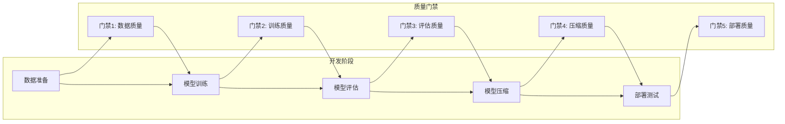
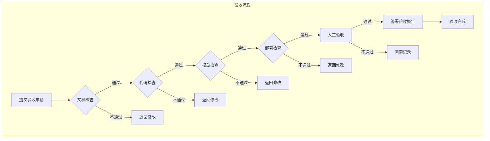

# 69 质量门禁与验收标准

> **版本**: v1.0.0
> **更新日期**: 2026-04-14
> **适用范围**: AI大模型开发全生命周期

---

## 概述 (Overview)

本文档定义AI大模型开发的质量门禁体系和验收标准，涵盖文档质量、代码质量、模型质量、部署质量等各个维度的检查清单和指标要求，确保交付物符合质量标准。

## 一、质量门禁体系 (Quality Gates)

### 1.1 门禁检查点



### 1.2 门禁检查矩阵

| 门禁 | 检查内容 | 通过标准 | 检查方式 | 负责人 |
|-----|---------|---------|---------|-------|
| 门禁1 | 数据质量 | 覆盖率≥95%, 无PII泄漏 | 自动检查脚本 | 数据工程师 |
| 门禁2 | 训练质量 | loss收敛, 无异常 | 训练日志审查 | 算法工程师 |
| 门禁3 | 评估质量 | 指标达标, 人工评估通过 | 自动化+人工 | 测试工程师 |
| 门禁4 | 压缩质量 | 精度损失<2%, 压缩比达标 | 对比测试 | 算法工程师 |
| 门禁5 | 部署质量 | 功能测试100%, 性能达标 | CI/CD流水线 | DevOps |

---

## 二、文档质量标准 (Documentation Quality)

### 2.1 文档覆盖率要求

| 文档模块 | 覆盖率要求 | 验收指标 | 检查方式 |
|---------|-----------|---------|---------|
| 总览文档 | 100% | 所有模块有索引页 | 自动化检查 |
| API文档 | 100% | 所有端点有完整说明 | 自动化检查 |
| 教程文档 | ≥90% | 核心流程有教程 | 人工审查 |
| 代码示例 | 100% | 所有代码块可运行 | CI验证 |
| 中英文对照 | ≥80% | 关键参数有对照 | 人工审查 |

### 2.2 文档格式规范

```yaml
# 文档格式检查配置
markdown_lint:
  rules:
    - name: "heading-order"
      level: "error"
      description: "标题层级必须连续"

    - name: "no-duplicate-heading"
      level: "error"
      description: "不允许重复标题"

    - name: "first-line-heading"
      level: "warning"
      description: "文件开头应为标题"

    - name: "fenced-code-language"
      level: "error"
      description: "代码块必须指定语言"

    - name: "link-style"
      level: "warning"
      description: "推荐使用相对链接"

    - name: "no-trailing-spaces"
      level: "warning"
      description: "行尾不应有空格"
```

### 2.3 文档质量检查脚本

```javascript
// docs/tools/validate-doc-quality.mjs
import fs from 'node:fs';
import path from 'node:path';

const REQUIRED_HEADERS = [
    '概述', 'Overview',
    '参数说明', 'Parameters',
    '返回值', 'Return',
    '变更记录', 'Changelog'
];

function validateDocument(filePath) {
    const content = fs.readFileSync(filePath, 'utf-8');
    const errors = [];
    const warnings = [];

    // 检查必需章节
    for (const header of REQUIRED_HEADERS) {
        if (!content.includes(`## ${header}`) && !content.includes(`# ${header}`)) {
            warnings.push(`建议包含章节: ${header}`);
        }
    }

    // 检查代码示例
    const codeBlocks = content.match(/```[\s\S]*?```/g) || [];
    for (const block of codeBlocks) {
        const lang = block.match(/```(\w+)/)?.[1];
        if (!lang) {
            errors.push('代码块缺少语言标识');
        }
    }

    // 检查中英文混合
    const hasChinese = /[\u4e00-\u9fa5]/.test(content);
    const hasEnglish = /[a-zA-Z]/.test(content);
    if (hasChinese && !hasEnglish) {
        warnings.push('建议添加英文说明');
    }

    return { errors, warnings };
}

function runValidation(docsDir) {
    const results = [];

    for (const file of fs.readdirSync(docsDir)) {
        if (file.endsWith('.md')) {
            const result = validateDocument(path.join(docsDir, file));
            results.push({ file, ...result });
        }
    }

    const failedCount = results.filter(r => r.errors.length > 0).length;
    console.log(`文档检查完成: ${results.length - failedCount}/${results.length} 通过`);

    if (failedCount > 0) {
        console.log('\n失败文档:');
        results.filter(r => r.errors.length > 0).forEach(r => {
            console.log(`  - ${r.file}`);
            r.errors.forEach(e => console.log(`    × ${e}`));
        });
    }

    return failedCount === 0;
}

export { validateDocument, runValidation };
```
---

## 三、代码质量标准 (Code Quality)

### 3.1 代码规范检查

```yaml
# .github/workflows/ci-code-quality.yml
name: Code Quality Check

on:
  push:
    branches: [main, develop]
  pull_request:
    branches: [main]

jobs:
  lint:
    runs-on: ubuntu-latest
    steps:
      - uses: actions/checkout@v4

      - name: Set up Python
        uses: actions/setup-python@v4
        with:
          python-version: '3.10'

      - name: Install dependencies
        run: |
          pip install ruff black flake8 mypy

      - name: Run Ruff
        run: ruff check .

      - name: Run Black
        run: black --check .

      - name: Run MyPy
        run: mypy .

  test:
    runs-on: ubuntu-latest
    steps:
      - uses: actions/checkout@v4

      - name: Set up Python
        uses: actions/setup-python@v4
        with:
          python-version: '3.10'

      - name: Run tests
        run: pytest tests/ -v

      - name: Upload coverage
        uses: codecov/codecov-action@v3
```

### 3.2 代码示例可运行性检查

```bash
#!/bin/bash
# scripts/validate-code-snippets.sh

set -e

echo "开始验证代码示例可运行性..."

# Python代码块验证
echo "检查Python代码块..."
for file in docs/*.md; do
    python -c "
import ast
import re

with open('$file', 'r') as f:
    content = f.read()

# 提取Python代码块
pattern = r'\`\`\`python\n([\s\S]*?)\`\`\`'
matches = re.findall(pattern, content)

for i, code in enumerate(matches):
    try:
        ast.parse(code)
        print(f'✓ $file 代码块 {i+1} 语法正确')
    except SyntaxError as e:
        print(f'✗ $file 代码块 {i+1} 语法错误: {e}')
        exit(1)
"
done

# JSON代码块验证
echo "检查JSON代码块..."
for file in docs/*.md; do
    python -c "
import json
import re

with open('$file', 'r') as f:
    content = f.read()

pattern = r'\`\`\`json\n([\s\S]*?)\`\`\`'
matches = re.findall(pattern, content)

for i, code in enumerate(matches):
    try:
        json.loads(code)
        print(f'✓ $file JSON块 {i+1} 格式正确')
    except json.JSONDecodeError as e:
        print(f'✗ $file JSON块 {i+1} 格式错误: {e}')
        exit(1)
"
done

# YAML代码块验证
echo "检查YAML代码块..."
for file in docs/*.md; do
    python -c "
import yaml
import re

with open('$file', 'r') as f:
    content = f.read()

pattern = r'\`\`\`yaml\n([\s\S]*?)\`\`\`'
matches = re.findall(pattern, content)

for i, code in enumerate(matches):
    try:
        yaml.safe_load(code)
        print(f'✓ $file YAML块 {i+1} 格式正确')
    except yaml.YAMLError as e:
        print(f'✗ $file YAML块 {i+1} 格式错误: {e}')
        exit(1)
"
done

echo "代码示例验证完成!"
```

---

## 四、模型质量标准 (Model Quality)

### 4.1 训练质量指标

| 指标 | 达标标准 | 测量方法 | 最低要求 |
|-----|---------|---------|---------|
| Loss收敛 | 最终Loss < 初始Loss × 0.3 | 训练日志 | 满足 |
| 梯度稳定性 | 梯度范数 < 1.0 | 训练监控 | 无NaN |
| 学习率 | 使用warmup + cosine | 训练配置 | 满足 |
| Token效率 | GPU利用率 > 60% | NVIDIA-SMI | > 40% |

### 4.2 模型评估指标

```python
# model_evaluation_metrics.py
from dataclasses import dataclass
from typing import Dict, List, Optional

@dataclass
class EvaluationMetrics:
    """模型评估指标 / Model Evaluation Metrics"""

    # 自动化评估指标
    perplexity: float                    # 困惑度
    accuracy: float                      # 准确率（分类任务）
    bleu_score: float                    # BLEU分数（生成任务）
    rouge_score: float                   # ROUGE分数

    # 人工评估指标
    human_scores: Dict[str, float]       # 人工评分

    # 安全指标
    safety_score: float                  # 安全性评分
    bias_metrics: Dict[str, float]      # 偏见指标

    def meets_standards(self, thresholds: dict) -> tuple[bool, List[str]]:
        """
        检查是否达到质量标准

        返回值 (Return Value):
            tuple[bool, List[str]] - (是否达标, 不达标项列表)
        """
        failures = []

        if self.perplexity > thresholds.get("max_ppl", 100):
            failures.append(f"困惑度过高: {self.perplexity:.2f}")

        if self.safety_score < thresholds.get("min_safety", 0.95):
            failures.append(f"安全性不足: {self.safety_score:.2%}")

        for aspect, score in self.human_scores.items():
            min_score = thresholds.get(f"min_{aspect}", 3.5)
            if score < min_score:
                failures.append(f"{aspect}评分不足: {score:.1f}")

        return len(failures) == 0, failures

EVALUATION_THRESHOLDS = {
    # 自动化指标
    "max_ppl": 50,                      # 最大困惑度
    "min_accuracy": 0.85,               # 最小准确率
    "min_bleu": 0.3,                    # 最小BLEU分数

    # 人工指标
    "min_relevance": 3.5,               # 最小相关性评分
    "min_helpfulness": 3.5,             # 最小有用性评分
    "min_safety": 0.95,                 # 最小安全性

    # 安全指标
    "max_bias_score": 0.1,              # 最大偏见分数
}
```

### 4.3 模型质量检查清单

```yaml
# model_quality_checklist.yaml
model_quality:
  pre_release_checklist:
    - name: "数据质量检查"
      items:
        - "训练数据无PII泄漏"
        - "数据多样性满足要求"
        - "数据标注一致性 > 80%"

    - name: "训练过程检查"
      items:
        - "Loss正常收敛"
        - "无NaN/Inf"
        - "GPU利用率正常"
        - "保存checkpoint可用"

    - name: "模型效果检查"
      items:
        - "困惑度达标"
        - "安全性评分 > 0.95"
        - "偏见指标达标"
        - "人工评估通过"

    - name: "模型安全检查"
      items:
        - "无后门植入"
        - "对抗攻击测试通过"
        - "提示词注入防护有效"
```

---

## 五、部署质量标准 (Deployment Quality)

### 5.1 部署前检查

```bash
#!/bin/bash
# scripts/pre-deploy-check.sh

set -e

echo "=== 部署前检查 ==="

# 1. 模型文件检查
echo "[1/5] 检查模型文件..."
if [ ! -f "$MODEL_PATH/pytorch_model.bin" ]; then
    echo "✗ 模型文件不存在"
    exit 1
fi
echo "✓ 模型文件存在"

# 2. 配置文件检查
echo "[2/5] 检查配置文件..."
if [ ! -f "$MODEL_PATH/config.json" ]; then
    echo "✗ 配置文件不存在"
    exit 1
fi
echo "✓ 配置文件存在"

# 3. 分词器检查
echo "[3/5] 检查分词器..."
if [ ! -f "$MODEL_PATH/tokenizer.json" ]; then
    echo "✗ 分词器文件不存在"
    exit 1
fi
echo "✓ 分词器存在"

# 4. 模型加载测试
echo "[4/5] 测试模型加载..."
python -c "
from transformers import AutoModel
model = AutoModel.from_pretrained('$MODEL_PATH')
print('✓ 模型加载成功')
"
echo "✓ 模型加载成功"

# 5. 推理测试
echo "[5/5] 测试推理功能..."
python -c "
from transformers import pipeline
generator = pipeline('text-generation', model='$MODEL_PATH')
result = generator('测试输入', max_length=50)
if result and result[0]['generated_text']:
    print('✓ 推理功能正常')
else:
    print('✗ 推理功能异常')
    exit(1)
"
echo "✓ 推理功能正常"

echo "=== 部署前检查通过 ==="
```

### 5.2 性能基准

| 指标 | 目标值 | 最低要求 | 测量方法 |
|-----|-------|---------|---------|
| 吞吐量 | > 50 req/s | > 20 req/s | 压力测试 |
| P50延迟 | < 200ms | < 500ms | 性能测试 |
| P99延迟 | < 1000ms | < 2000ms | 性能测试 |
| 错误率 | < 0.1% | < 1% | 监控统计 |
| 可用性 | > 99.9% | > 99% | SLA监控 |

---

## 六、验收标准 (Acceptance Criteria)

### 6.1 验收指标体系

| 维度 | 指标 | 目标值 | 验收标准 | 测量方式 |
|-----|------|-------|---------|---------|
| 文档覆盖率 | 文档完整率 | ≥95% | 核心模块100% | 自动化检查 |
| 文档质量 | 首次成功率 | ≥90% | 核心教程通过 | 人工验证 |
| 用户满意度 | 满意度评分 | ≥4.5/5 | 反馈调查 | 问卷调查 |
| 代码质量 | 代码通过率 | ≥95% | CI全部通过 | CI流水线 |
| 模型质量 | 指标达标率 | 100% | 所有指标达标 | 自动化+人工 |

### 6.2 缺陷修复SLA

```yaml
# defect_sla.yaml
defect_resolution:
  # 缺陷严重等级
  severity:
    critical:
      description: "系统崩溃或核心功能不可用"
      response_time: "1小时"
      resolution_time: "24小时"
      examples:
        - "服务无法启动"
        - "模型推理完全失败"
        - "数据丢失"

    high:
      description: "严重影响用户体验"
      response_time: "4小时"
      resolution_time: "72小时"
      examples:
        - "推理结果严重错误"
        - "性能严重下降"
        - "安全漏洞"

    medium:
      description: "影响部分功能"
      response_time: "24小时"
      resolution_time: "7天"
      examples:
        - "部分场景推理异常"
        - "API返回格式错误"
        - "文档错误"

    low:
      description: "轻微问题或改进建议"
      response_time: "72小时"
      resolution_time: "30天"
      examples:
        - "文档排版问题"
        - "示例代码可优化"
        - "用户体验改进"
```

### 6.3 验收流程


---

## 七、持续改进 (Continuous Improvement)

### 7.1 质量回顾

```yaml
# quality_review.yaml
quality_review:
  frequency: "月度"
  participants:
    - "技术负责人"
    - "算法工程师"
    - "测试工程师"
    - "产品经理"

  agenda:
    - "缺陷趋势分析"
    - "门禁通过率统计"
    - "用户反馈汇总"
    - "改进措施制定"

  outputs:
    - "质量月报"
    - "改进计划"
    - "风险评估"
```

### 7.2 质量指标仪表盘

```yaml
# quality_dashboard.yaml
dashboard:
  title: "AI大模型开发质量仪表盘"

  metrics:
    - name: "文档覆盖率"
      type: "gauge"
      target: 95
      current: "query(文档覆盖率指标)"

    - name: "代码通过率"
      type: "gauge"
      target: 95
      current: "query(CI通过率)"

    - name: "模型质量评分"
      type: "gauge"
      target: 90
      current: "query(模型评估分数)"

    - name: "缺陷修复及时率"
      type: "gauge"
      target: 90
      current: "query(缺陷修复统计)"

    - name: "用户满意度"
      type: "gauge"
      target: 4.5
      current: "query(满意度调查)"
```

---

## 变更记录

| 日期 | 版本 | 变更内容 |
|-----|------|---------|
| 2026-04-14 | v1.0.0 | 初始版本 |

---

## 相关文档

- [60-AI大模型开发总览.md](60-AI大模型开发总览.md) - 文档体系索引
- [67-AI-API参考手册.md](67-AI-API参考手册.md) - API参考
- [68-端到端实战教程.md](68-端到端实战教程.md) - 实战教程
