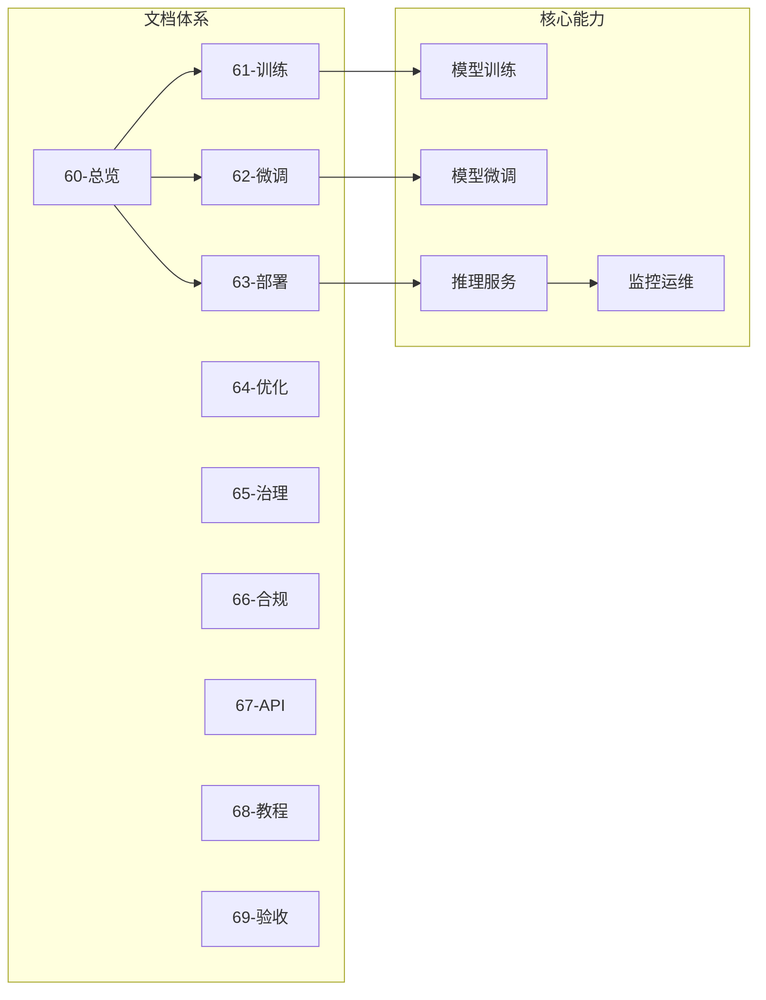
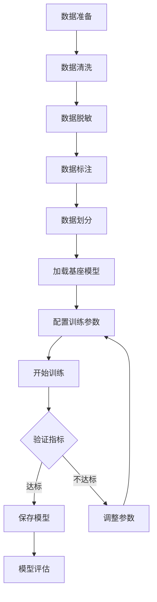
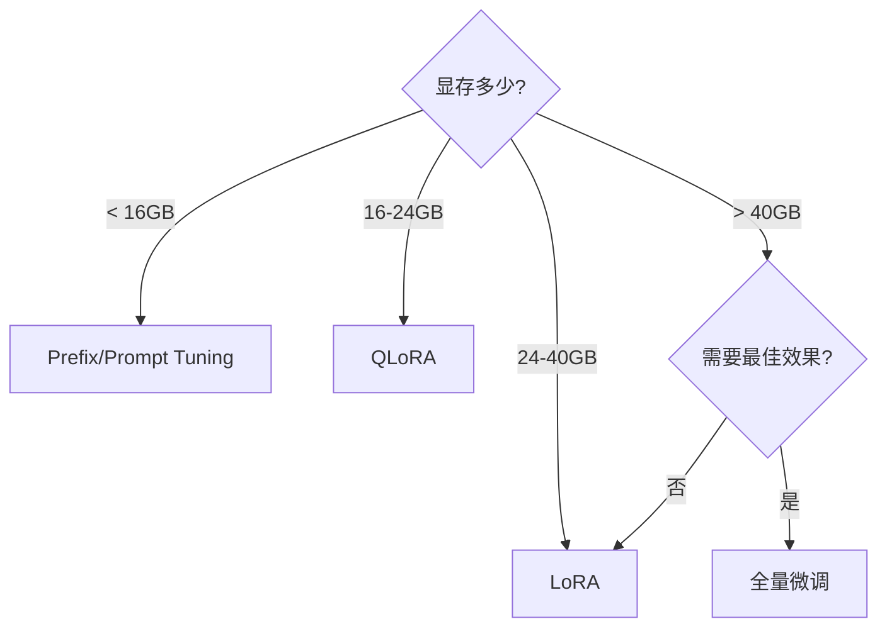

# AI-新成员快速上手指南

> **版本**: v1.0.0
> **更新日期**: 2026-04-14
> **目标读者**: 新加入AI大模型开发团队成员
> **预计阅读时间**: 30分钟

---

## 文档目的

本文档为AI大模型开发团队的新成员提供系统性的入门指引，帮助您在最短时间内了解项目全貌、搭建开发环境、掌握核心工具链。

## 阅读前提

- 具备Python编程基础
- 了解机器学习/深度学习基本概念
- 有GPU编程经验者更佳（非必需）

---

## 一、项目概览

### 1.1 AI大模型开发体系



### 1.2 技术栈速查表

| 类别 | 技术 | 版本要求 | 用途 |
|-----|------|---------|-----|
| 运行时 | Python | 3.10+ | 核心开发语言 |
| 深度学习 | PyTorch | 2.0+ | 模型训练框架 |
| 预训练模型 | Transformers | 4.36+ | 模型加载与推理 |
| 模型优化 | PEFT | 0.7+ | LoRA/QLoRA微调 |
| 量化加速 | bitsandbytes | 0.41+ | 4bit量化 |
| 高性能推理 | vLLM | 0.2+ | 服务化部署 |
| 分布式训练 | DeepSpeed | 0.12+ | 多卡训练 |
| 实验管理 | wandb | - | 训练可视化 |

---

## 二、环境搭建（30分钟）

### 2.1 硬件要求

| 场景 | GPU显存 | CPU | 内存 | 存储 |
|-----|--------|-----|------|------|
| **推理学习** | 8GB | 4核 | 16GB | 50GB |
| **LoRA微调** | 24GB | 8核 | 32GB | 100GB |
| **QLoRA微调** | 16GB | 8核 | 32GB | 100GB |
| **全量微调** | 80GB | 16核 | 128GB | 500GB |

### 2.2 快速安装脚本

```bash
#!/bin/bash
# setup_ai_env.sh - AI开发环境一键安装脚本

# 1. 创建conda环境
conda create -n llm-dev python=3.10 -y
conda activate llm-dev

# 2. 安装PyTorch（CUDA 11.8）
pip install torch==2.2.0 torchvision torchaudio \
    --index-url https://download.pytorch.org/whl/cu118

# 3. 安装核心依赖
pip install \
    transformers==4.38.0 \
    peft==0.7.0 \
    accelerate==0.25.0 \
    bitsandbytes==0.41.0 \
    datasets==2.16.0 \
    trl==0.7.0 \
    wandb==0.16.0 \
    deepspeed==0.12.0 \
    vllm==0.2.0 \
    scipy==1.11.0

# 4. 验证安装
python -c "
import torch
print(f'✓ PyTorch: {torch.__version__}')
print(f'✓ CUDA: {torch.cuda.is_available()}')
if torch.cuda.is_available():
    print(f'✓ GPU: {torch.cuda.get_device_name(0)}')
"
```

### 2.3 环境验证

```python
# verify_environment.py
import sys

def check_environment():
    """验证开发环境完整性"""
    results = []

    # 检查Python版本
    py_version = sys.version_info
    if py_version >= (3, 9):
        results.append(f"✓ Python {py_version.major}.{py_version.minor}")
    else:
        results.append(f"✗ Python版本过低: {py_version.major}.{py_version.minor}")

    # 检查PyTorch
    try:
        import torch
        results.append(f"✓ PyTorch {torch.__version__}")
        if torch.cuda.is_available():
            results.append(f"✓ CUDA可用: {torch.version.cuda}")
        else:
            results.append("⚠ CUDA不可用（仅CPU模式）")
    except ImportError:
        results.append("✗ PyTorch未安装")

    # 检查Transformers
    try:
        import transformers
        results.append(f"✓ Transformers {transformers.__version__}")
    except ImportError:
        results.append("✗ Transformers未安装")

    # 检查PEFT
    try:
        import peft
        results.append(f"✓ PEFT {peft.__version__}")
    except ImportError:
        results.append("✗ PEFT未安装")

    print("\n环境检查结果:")
    print("-" * 40)
    for r in results:
        print(r)

    return all("✓" in r for r in results)

if __name__ == "__main__":
    success = check_environment()
    sys.exit(0 if success else 1)
```

---

## 三、核心工作流

### 3.1 模型训练流程



### 3.2 典型任务：对话助手微调

**目标**: 使用QLoRA微调Llama2-7B构建客服助手

#### Step 1: 准备数据

```python
# prepare_data.py
import json

# 对话数据格式
conversation = {
    "messages": [
        {"role": "system", "content": "你是一个专业的电商客服"},
        {"role": "user", "content": "请问你们的退货政策是什么？"},
        {"role": "assistant", "content": "您好，我们的退货政策是：自收到商品之日起7天内可申请退货..."}
    ]
}

# 转换为训练文本
def format_conversation(conv):
    text = ""
    for msg in conv["messages"]:
        text += f"<|{msg['role']}|>\n{msg['content']}\n"
    return text

# 保存为JSONL
with open("train.jsonl", "w") as f:
    f.write(json.dumps({"text": format_conversation(conversation)}) + "\n")
```

#### Step 2: 启动QLoRA微调

```python
# train_qloRA.py
from transformers import AutoModelForCausalLM, AutoTokenizer, BitsAndBytesConfig
from peft import LoraConfig, get_peft_model
import torch

# 4bit量化配置
bnb_config = BitsAndBytesConfig(
    load_in_4bit=True,
    bnb_4bit_quant_type="nf4",
    bnb_4bit_compute_dtype=torch.bfloat16
)

# 加载模型
model = AutoModelForCausalLM.from_pretrained(
    "meta-llama/Llama-2-7b-hf",
    quantization_config=bnb_config,
    device_map="auto"
)

tokenizer = AutoTokenizer.from_pretrained("meta-llama/Llama-2-7b-hf")

# LoRA配置
lora_config = LoraConfig(
    r=64,
    lora_alpha=16,
    target_modules=["q_proj", "v_proj"]
)

model = get_peft_model(model, lora_config)
model.print_trainable_parameters()

# 开始训练（参见62-模型微调手册.md）
```

#### Step 3: 推理验证

```python
# inference.py
from transformers import AutoModelForCausalLM, AutoTokenizer
from peft import PeftModel

# 加载微调后的模型
base_model = AutoModelForCausalLM.from_pretrained("meta-llama/Llama-2-7b-hf")
model = PeftModel.from_pretrained(base_model, "./output")
tokenizer = AutoTokenizer.from_pretrained("meta-llama/Llama-2-7b-hf")

# 推理
prompt = "请问你们的退货政策是什么？"
inputs = tokenizer(prompt, return_tensors="pt")
outputs = model.generate(**inputs, max_new_tokens=200)
response = tokenizer.decode(outputs[0], skip_special_tokens=True)

print(f"用户: {prompt}")
print(f"助手: {response}")
```

---

## 四、文档速查

### 4.1 按任务类型

| 任务 | 推荐文档 | 章节 |
|-----|---------|-----|
| 搭建环境 | 61-模型训练指南.md | 第一章 |
| 数据清洗 | 65-数据治理规范.md | 第三章 |
| LoRA微调 | 62-模型微调手册.md | 第二章 |
| 量化压缩 | 64-性能优化与压缩.md | 第一章 |
| 服务部署 | 63-推理部署与上线.md | 第二章 |
| 监控告警 | 63-推理部署与上线.md | 第四章 |

### 4.2 按角色类型

| 角色 | 推荐阅读顺序 |
|-----|------------|
| 算法工程师 | 61 → 62 → 64 → 68 |
| 后端开发 | 63 → 64 → 67 → 68 |
| 数据工程师 | 65 → 61 → 68 |
| 安全合规 | 66 → 65 → 69 |

### 4.3 常用命令速查

```bash
# 环境相关
conda create -n llm python=3.10 && conda activate llm
pip install -r requirements-ai.txt

# 模型下载
huggingface-cli download meta-llama/Llama-2-7b-hf

# 训练相关
python train.py --config config.yaml
python -m vllm.entrypoints.openai.api_server --model ./model

# 监控相关
tensorboard --logdir ./logs
wandb sync

# 量化相关
python quantize.py --model ./model --bits 4
```

---

## 五、常见问题

### Q1: GPU显存不足 (CUDA Out of Memory)

**解决方案**:
```python
# 方法1: 减小batch_size
per_device_train_batch_size = 1

# 方法2: 启用梯度累积
gradient_accumulation_steps = 16

# 方法3: 启用梯度检查点
model.gradient_checkpointing_enable()

# 方法4: 使用QLoRA量化
bnb_config = BitsAndBytesConfig(load_in_4bit=True)
```

### Q2: 训练loss不下降

**检查清单**:
1. 数据是否正确加载
2. 学习率是否过高/过低
3. 梯度是否正常
4. 模型是否正确冻结

### Q3: 模型推理速度慢

**优化方法**:
```python
# 启用Flash Attention
config.attn_config = {"attn_type": "flash"}

# 使用vLLM推理
from vllm import LLM
llm = LLM(model="path/to/model", tensor_parallel_size=2)
```

### Q4: 如何选择微调方法？



---

## 六、下一步

完成本指南后，建议继续学习：

1. **深入学习**: [61-模型训练指南.md](61-模型训练指南.md)
2. **微调实战**: [62-模型微调手册.md](62-模型微调手册.md)
3. **端到端教程**: [68-端到端实战教程.md](68-端到端实战教程.md)
4. **完整索引**: [00-文档索引总纲.md](00-文档索引总纲.md)

---

## 附录：快速命令清单

```bash
# 克隆项目
git clone <repo-url>

# 安装依赖
pip install -r requirements.txt

# 运行测试
pytest tests/

# 启动训练
python scripts/train.py --config configs/lora.yaml

# 启动服务
python -m vllm.entrypoints.openai.api_server --model ./model

# 查看日志
tail -f logs/training.log

# 模型权重合并
python scripts/merge_lora.py --base-model ./base --lora ./lora --output ./merged
```

---

## 变更记录

| 日期 | 版本 | 变更内容 |
|-----|------|---------|
| 2026-04-14 | v1.0.0 | 初始版本 |

---

*如有问题，请联系技术负责人或查阅[69-质量门禁与验收标准.md](69-质量门禁与验收标准.md)*
