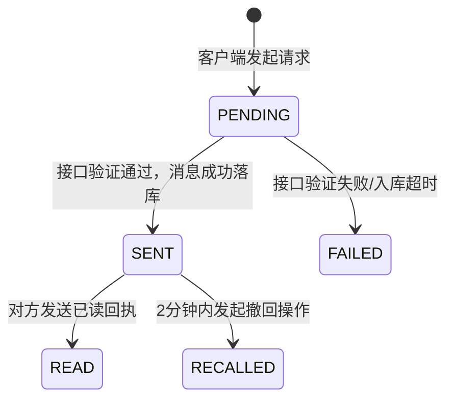

# 01 消息模块后端代码重构与规范

> **定位**：规范即时通信（IM）中核心消息收发链路的 Java 实现标准。本规范旨在确保系统符合高可用、低耦合、易扩展的企业级要求。在进行具体代码编写或重构时，全部基于本规范执行。

---

## 1. 架构目标与分层隔离

### 1.1 依赖关系规范
- **红线**：必须严格遵循 `Controller -> Service -> Mapper` 单向调用。
- **职责划分**：
  - **Controller**：仅处理 HTTP 路由、参数组装及全局权限校验，禁止写任何业务逻辑。必须使用 `@Validated` 进行入参校验，返回结果封装为统一的 `AjaxResult`。
  - **Service**：承载消息落库、未读计数、状态流转以及触发 WebSocket 推送的核心逻辑。
  - **Mapper / RPC**：数据库交互（MyBatis-Plus）或对外部服务的调用。

### 1.2 DTO/VO 转换规范
禁止将持久化层的 `Entity` 直接用于 Controller 层的传参或返回。
- 接收消息发送请求：使用 `SendMessageDTO`（仅包含用户传递的内容：会话ID、消息类型、正文）。
- 返回前端消息记录：使用 `MessageVO`（组装发送者昵称、头像以及脱敏后的字段）。

---

## 2. 核心全链路实现流程

### 2.1 文本消息发送状态流转与时序



### 2.2 核心 Java 接口规范模板

```java
/**
 * 消息核心业务处理接口
 */
public interface ImMessageService {

    /**
     * 发送即时消息（文本/图片/语音）
     * @param sendDTO 前端传递的消息属性
     * @param senderId 当前登录用户ID（通过SecurityUtils获取）
     * @return 组装后的 MessageVO 用于回显
     */
    MessageVO sendMessage(SendMessageDTO sendDTO, Long senderId);
    
    /**
     * 拉取历史消息记录（应用分页优化机制）
     * @param query 查询参数（含会话ID、上一条游标 msgId）
     * @return 消息列表，按时间正序
     */
    List<MessageVO> queryHistory(MessageQuery query);

    /**
     * 消息撤回处理
     * @param msgId 目标消息的全局唯一ID
     * @param userId 操作人ID
     */
    void recallMessage(Long msgId, Long userId);
}
```

---

## 3. 代码质量与企业级实现考量

### 3.1 异常处理与事务
- 必须使用 `@Transactional(rollbackFor = Exception.class)` 标注 `sendMessage`，保证消息表落库和会话表（最近一条消息、未读数更新）的原子性。
- 自定义业务异常 `MessageException`，并配合 `GlobalExceptionHandler` 输出前台可识别的 5 位错误码。

### 3.2 性能与扩展点设计
- **分发解耦**：当发生 `sendMessage` 后，可发布 Spring `ApplicationEvent`（例如 `MessageSendEvent`），由 WebSocket 推送服务异步监听该事件并执行长连接推送。这能将【落库】与【推送】解耦，防止网络抖动阻塞主业务。
- **主键生成**：摒弃数据库自增，使用 MyBatis-Plus 提供的雪花算法 `ASSIGN_ID`，以便为日后分库分表做前置储备。
- **并发防重**：前端发送请求需带上局部生成的 `clientMsgId`。若重试导致后端接收多笔相同 `clientMsgId`，应利用 Redis 或唯一索引做防重放控制，保证系统幂等。

---

> **结语**：此后端规范为消息模块的根基，重构或新增接口时，如发生不符合单一职责与三层隔离的旧代码，需毫不犹豫地将其抽象出 DTO 与 Event。
